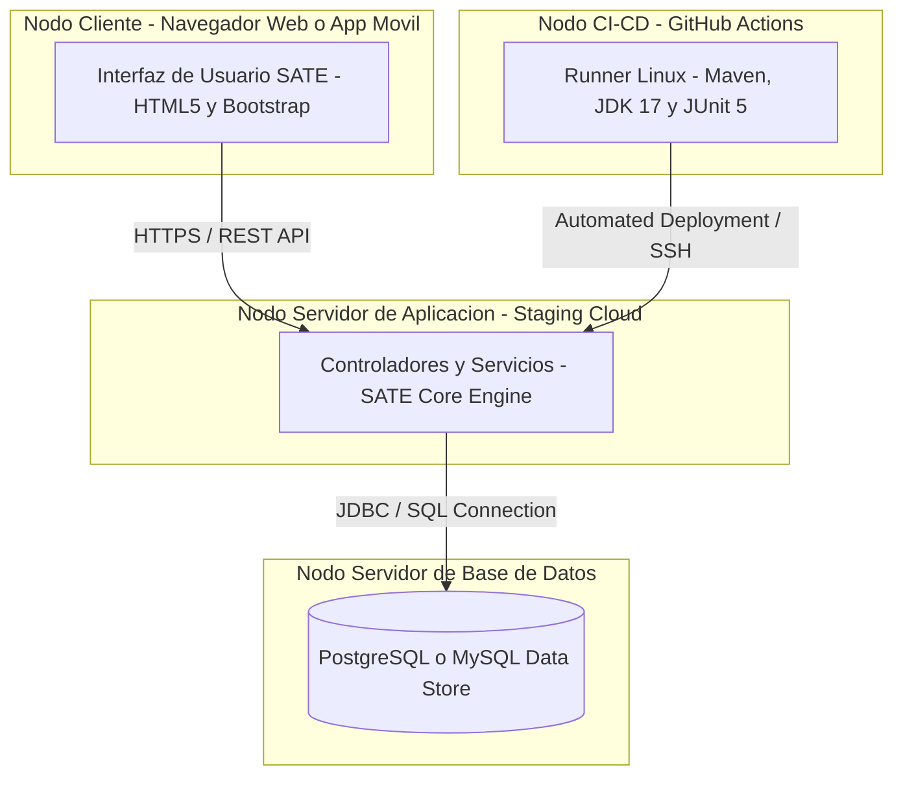

# Diagrama de Despliegue - SATE-UNIAJC

Representación de la infraestructura física y entornos del sistema para el ambiente de Staging.

```mermaid
graph TD
    subgraph ClientNode [Nodo Cliente - Navegador Web o App Movil]
        UI[Interfaz de Usuario SATE - HTML5 y Bootstrap]
    end
    
    subgraph GitHubNode [Nodo CI-CD - GitHub Actions]
        Runner[Runner Linux - Maven, JDK 17 y JUnit 5]
    end
    
    subgraph AppServerNode [Nodo Servidor de Aplicacion - Staging Cloud]
        MVC[Controladores y Servicios - SATE Core Engine]
    end
    
    subgraph DBNode [Nodo Servidor de Base de Datos]
        DB[(PostgreSQL o MySQL Data Store)]
    end

    UI -->|HTTPS / REST API| MVC
    Runner -->|Automated Deployment / SSH| MVC
    MVC -->|JDBC / SQL Connection| DB
```
