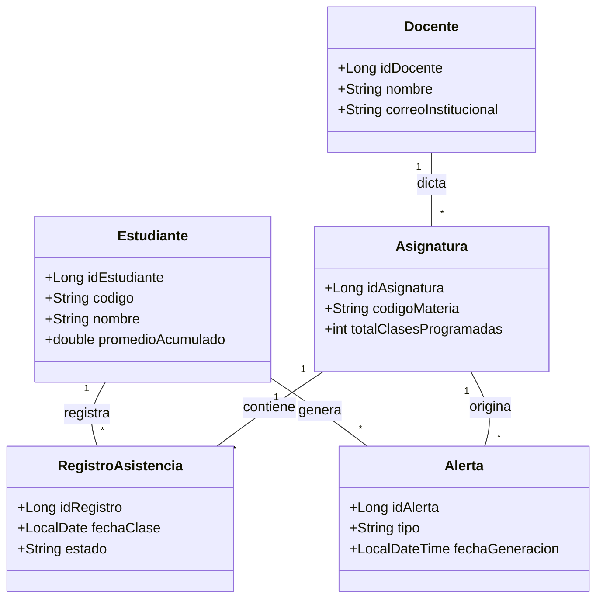

# Modelo Conceptual del Dominio - SATE-UNIAJC
## Equipo: CamachoDevs

```mermaid
classDiagram
    Estudiante "1" -- "*" Alerta : genera
    Estudiante "1" -- "*" RegistroAsistencia : registra
    Docente "1" -- "*" Asignatura : dicta
    Asignatura "1" -- "*" RegistroAsistencia : contiene
    Asignatura "1" -- "*" Alerta : origina

    class Estudiante {
        +Long idEstudiante
        +String codigo
        +String nombre
        +double promedioAcumulado
    }
    class Docente {
        +Long idDocente
        +String nombre
        +String correoInstitucional
    }
    class Asignatura {
        +Long idAsignatura
        +String codigoMateria
        +int totalClasesProgramadas
    }
    class RegistroAsistencia {
        +Long idRegistro
        +LocalDate fechaClase
        +String estado
    }
    class Alerta {
        +Long idAlerta
        +String tipo
        +LocalDateTime fechaGeneracion
    }
```

